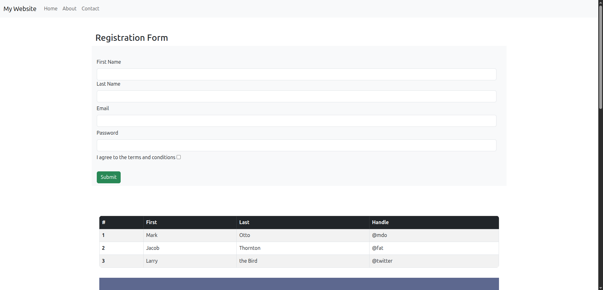
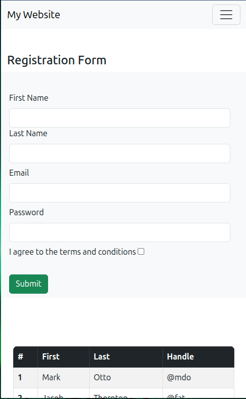

 

This is a mock site exhibiting html enhanced with Bootstrap styling.

It consists of one page. All components are designed to be responsive on any screensize.

   <ol> <b>Outline</b>
      <li>Navbar</li>
      <li>Registration Form </li>
      <li>Table </li>
      <li>Images </li>
      <li>Buttons </li>
    </ol>

1. Navbar
    The Navbar consists of three links:
        a. Home
        b. About
        c. Contact
    On larger screens, the navigation bar shows the website logo and the three links. On smaller screens, the navigation bar shows the website logo and a hamburger menu.

2. Registration Form
    The registration form consists of four input fields:
        a. First Name
        b. Last Name
        c. Email
        d. Password
    The form is followed with a checkbox that must be checked to submit the form. Form validation is enabled on the 'Email', 'Password', and the checkbox.

3. Table
    The table consists of a header row and three rows of data. The data is hard-coded in the table. The table is responsive on any screensize. Styling with bootstrap has been added for padding, margins, borders and rounded corners. A hover effect is added to the table rows as well as a striped background for better readability.

4. Images
    The Image section consists of two images. Both images are fluid and responsive to the screen-size so they can be viewed on any screensize. The first image is simple fluid image and the second image is a circular, rounded fluid image.

5. Buttons
    The bottons section consists of two buttons. Both buttons have a built-in hover effect. The first button is a primary button and the second button is a secondary button. The second button is designed to be hidden on larger screens.
